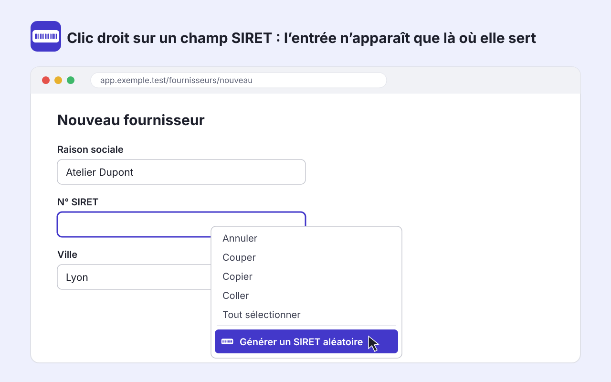

# SIRET Form Filler

[](https://github.com/Thodebug/siret-form-filler/actions/workflows/ci.yml)

**Page de démonstration : https://thodebug.github.io/siret-form-filler/**

Extension Firefox, Chrome et Edge pour tester des formulaires français.
Un clic droit sur un champ SIRET ou SIREN propose d'y écrire un numéro aléatoire, fictif mais valide.



## Fonctionnalités

- Entrée de menu affichée uniquement sur les champs SIRET et SIREN reconnus, sur tous les sites
- SIRET de 14 chiffres et SIREN de 9 chiffres, avec des clés de Luhn valides
- Reconnaissance par id, name, libellé, placeholder, attributs ARIA, longueur, pattern et masque de saisie
- Champs TVA, NIC et RCS écartés
- Masques de saisie (PrimeNG...), shadow DOM, iframes et champs ajoutés dynamiquement
- Valeur prise en compte par React, Angular et Vue, Ctrl+Z annule
- Fonctionne aussi avec la touche Menu et Maj+F10

## Installation

**Firefox 142+** : [addons.mozilla.org](https://addons.mozilla.org/firefox/addon/siret-form-filler/)

**Chrome et Edge 123+** :

1. Téléchargez `siret-form-filler-chromium-X.Y.Z.zip` depuis la [dernière release](https://github.com/Thodebug/siret-form-filler/releases/latest) et dézippez-le.
2. Ouvrez `chrome://extensions` (ou `edge://extensions`) et activez le mode développeur.
3. Cliquez sur « Charger l'extension non empaquetée » et choisissez le dossier.
4. Rechargez les onglets déjà ouverts.

## Limites

- Aucune plage de numéros n'est réservée aux tests : un numéro généré peut correspondre à une entreprise réelle.
- Le numéro est écrit sans espaces.
- Sous Chrome et Edge, le premier clic droit après une mise en veille de l'extension peut afficher l'état précédent du menu.
- Les `textarea` et `contenteditable` ne sont pas pris en charge.

## Développement

```sh
npm ci
npm run check            # lint, types, tests, build et web-ext lint
npm run start:firefox    # lance Firefox avec l'extension
npm run start:chromium   # lance Chromium avec l'extension
```

Il n'y a pas d'étape de compilation : les fichiers de `extension/` sont ceux qui sont publiés.
`npm run build` écrit un manifeste et un zip par navigateur dans `dist/`.

Un champ mal reconnu ? Ajoutez-le dans `test/fixtures/detection.html` avec `data-expected` (14, 9 ou 0).

## Structure du projet

```
extension/
  manifest.json           manifeste commun aux navigateurs
  background/
    background.js         entrée du menu contextuel
  content/
    numbers.js            génération et validation des SIRET et SIREN
    detection.js          reconnaissance des champs
    fill.js               écriture de la valeur dans le champ
    content.js            liaison entre la page et le menu
  _locales/fr/            textes de l'interface
  icons/                  icônes générées depuis assets/icon.svg
site/                     page de démonstration et politique de confidentialité
test/                     tests et fixtures de détection
scripts/                  build, contrôle de version, icônes, images de la fiche
store/amo/                textes et images de la fiche addons.mozilla.org
docs/SPEC.md              spécification
.github/workflows/        vérifications, GitHub Pages, releases
```

## Publier une version

Mettez la même version dans `package.json` et `extension/manifest.json`, puis poussez un tag `vX.Y.Z`.
Le workflow crée la release GitHub avec les zips et soumet la version à AMO si les secrets `AMO_JWT_ISSUER` et `AMO_JWT_SECRET` sont définis.

## Confidentialité

Aucune donnée n'est collectée ni envoyée. L'accès à tous les sites sert uniquement à examiner le champ cliqué.
Voir la [politique de confidentialité](https://thodebug.github.io/siret-form-filler/confidentialite.html).

## Licence

Le code est publié sous licence MIT (voir [LICENSE](LICENSE)).

Le code a été écrit avec un assistant IA (Claude).
